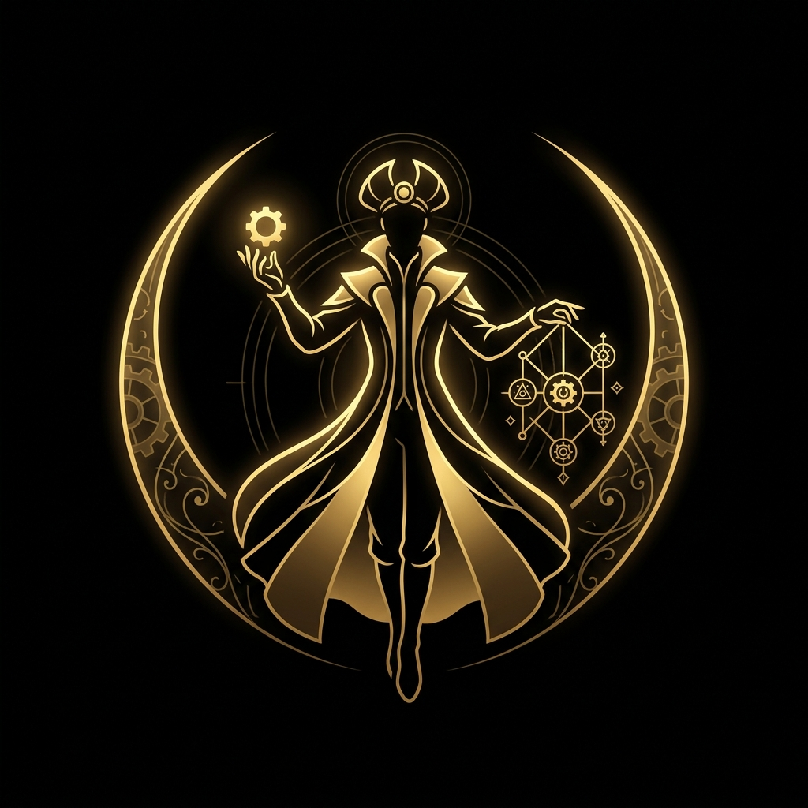

<div align="center">
  
  <h1>Amalgam Conductor Ecosystem</h1>
  <p><strong>The routing, implementation, and communication layer for AI workflow automation.</strong></p>
  
  [](#-installation)
  [](#-installation)
  [](#-safe-updates)
</div>

---

## 🎯 Purpose

Amalgam Conductor coordinates AI-assisted software engineering. Instead of a single messy prompt, tasks are routed through a highly disciplined trifecta of orchestration, implementation, and communication, backed by domain specialists.

## 🏗️ The Ecosystem Trinity

The core engine relies on three distinct layers working together to prevent token bloat and over-engineering:

1.  **[Amalgam Conductor](skills/amalgam-conductor/SKILL.md) (Orchestrator)** 
   - Defines the task boundary. Decides *what* gets built and *who* builds it.
   - Prevents sequencing errors, unauthorized actions, and overlapping reviews.
2. 👱 **[Ponytail](https://github.com/Baelfyre/ponytail) (Implementation Engine)**
   - The lazy senior developer. Writes the absolute minimum code required.
   - Uses native features and standard libraries before adding dependencies. No architecture redesigns.
3. 🪨 **[Caveman](https://github.com/Baelfyre/caveman) (Global Protocol)**
   - The communication standard. Strips out conversational filler and formatting bloat.
   - Outputs only what matters: actionable code, skipped steps, and required context.

---

## 🧩 The Specialists

When Amalgam Conductor identifies a cross-domain feature, it routes the task to the appropriate specialist.

| Specialist | Use Case | Avoid When |
| :--- | :--- | :--- |
|  **Amalgam Conductor** | Routing, overlap control, token efficiency | A single obvious specialist suffices |
|  **Clockwork Meister** | OOP/Layered architecture, system design, refactoring | Modifying UI or writing docs |
|  **Cloak Meister** | UI/UX, layout, components, accessibility | DB or system-diagram ownership |
|  **Meister Chronicler**| DB schema, migrations, SQL, constraints | UI review |
|  **Scribe Meister** | Documentation, READMEs, technical writing | Inventing technical facts |
|  **Meister Weaver** | UML, ERD visuals, workflow diagrams | DB semantics without source |
|  **Acme Overseer** | QA, tests, release readiness, regression | Destructive pressure testing |
|  **Cipher Meister** | Security/privacy evidence, auth, secrets | Offensive testing |
|  **Hidden Dagger** | Approved destructive/resilience testing | Unauthorized testing |

> [!TIP]
> See [SKILL_INDEX.md](SKILL_INDEX.md) for the full specialist index and their expected behavior.

---

## 🚦 Recommended Workflow

1. **Single-Domain Tasks**: Route directly to the executing specialist (e.g., `Ponytail` for code, `Cloak Meister` for UI).
2. **Cross-Domain Features**: Start with `Amalgam Conductor`. It will sequence the required specialists in execution order.
3. **Communication**: All output defaults to the `Caveman` protocol. 
4. **Implementation**: Code generation defaults to `Ponytail` logic (shortest path, stdlib first).

---

## 🚀 Installation

Amalgam Conductor supports dual-environment compatibility and can be installed as a native plugin in both Antigravity and Codex.

### 1. Antigravity Plugin Setup
```sh
agy plugin install https://github.com/Baelfyre/amalgam-conductor
```

### 2. Codex Plugin Setup
Clone the repository into your Codex plugins directory:
```sh
git clone https://github.com/Baelfyre/amalgam-conductor.git
```
Codex will automatically detect the `.codex-plugin/plugin.json` manifest and map the `skills/` directory.

> [!NOTE]
> For manual setup (copying raw skills without a plugin manager), see [INSTALLATION.md](INSTALLATION.md).

---

## 🔄 Safe Updates

> [!WARNING]
> Fully automatic updates are discouraged. Unvalidated changes to skill frontmatter or routing logic can silently break your workflows.

To safely update the ecosystem across any framework, run the included update script. This script automatically checks your git status, fetches the latest changes, and triggers the validation suite:

```powershell
powershell -ExecutionPolicy Bypass -File .\scripts\update-plugin.ps1
```

For manual updates and rollback instructions, see [INSTALLATION.md](INSTALLATION.md).

---

## 🛡️ Git Safety & Compatibility

- **Markdown-first**: Instructions are portable across tools (Codex, VS Code, Antigravity, Claude Code).
- **Safety**: Keep experimental AI instruction files isolated. Use `.git/info/exclude` to prevent committing them to your production repositories unless explicitly intended.

**Manifest consistency check:**
```powershell
powershell -ExecutionPolicy Bypass -File .\scripts\validate-manifest.ps1
```

---

## ⚠️ DISCLAIMER

> [!CAUTION]
> Please read the [DISCLAIMER.md](DISCLAIMER.md) before using this ecosystem in real-world applications or production environments.
